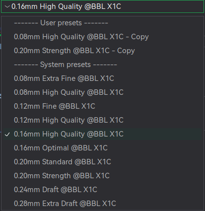

# Kvalitet og oppløsning

Det anbefales å bruke en av innstillingene markert med *High Quality* ettersom disse har en betraktelig roligere hastighet enn mange av de øvrige valgene. Det er spesielt viktig å passe på at man ikke forsøker å printe for fort hvis man har små, eller mange, deler. Desto høyere hastighet, desto høyere risiko for at noe kommer til å løsne fra byggeplata.

## Hva bestemmer kvaliteten på printen?

* Nozzle: Størrelsen på dysen bestemmer hvor brede/tykke streker man kan printe. Desto mindre dyse, desto finere detaljer kan man få i XY-aksen (horisontalt plan).
* Layer height: Dette er bakgrunnen for at programvaren man bruker for å forberede en modell for printing kalles slicing. En slicer tar en model og kutter den i horisontale tverssnitt av modellen. Antallet slike lag i en modell være omtrent *ModellHøyeden / LayerHeight*.
* Hastighet: Det siste leddet som styrer kvaliteten på en print er hvor raskt man flytter printerhodet, og hvor fort man kan dytte plast ut av dysen. Desto lavere hastighet, desto høyere kvalitet.