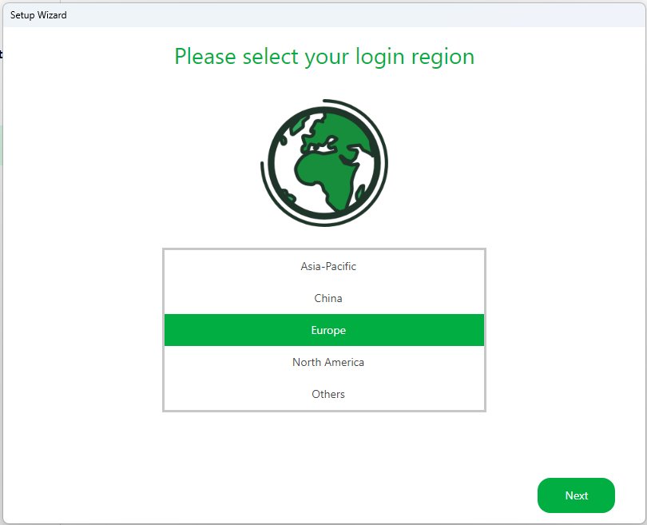
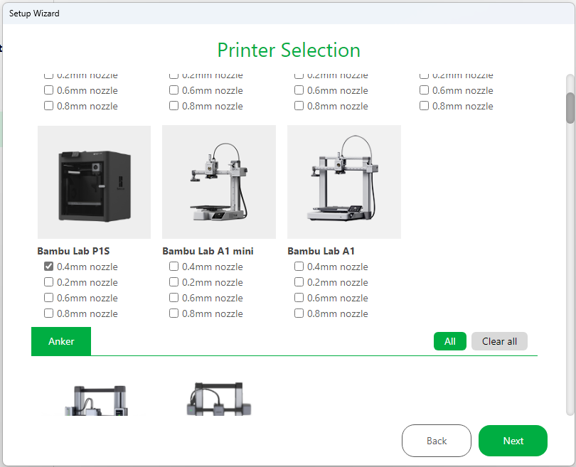
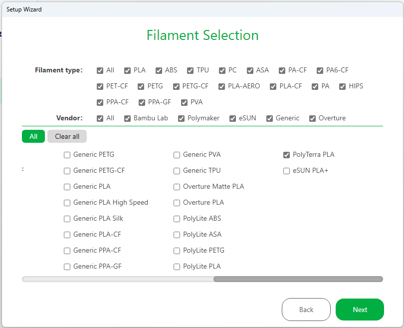
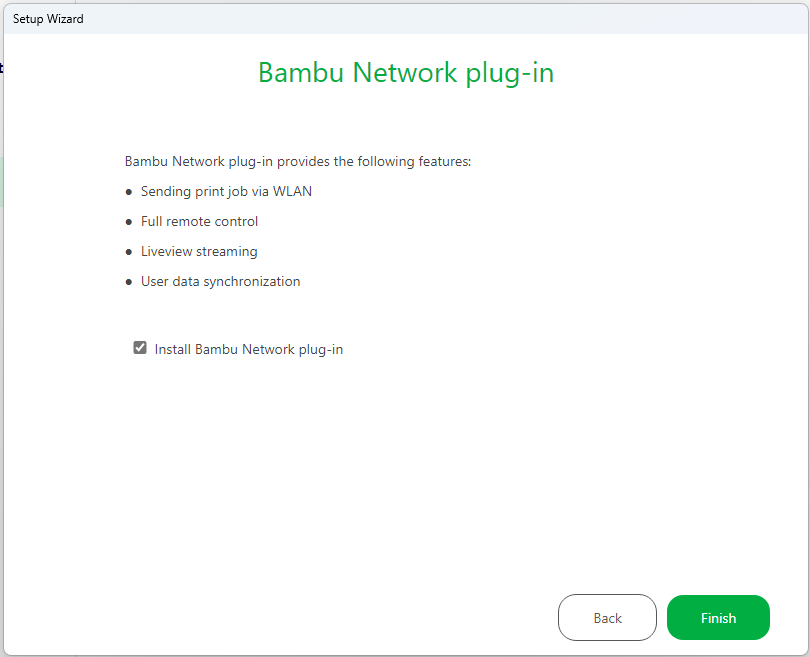
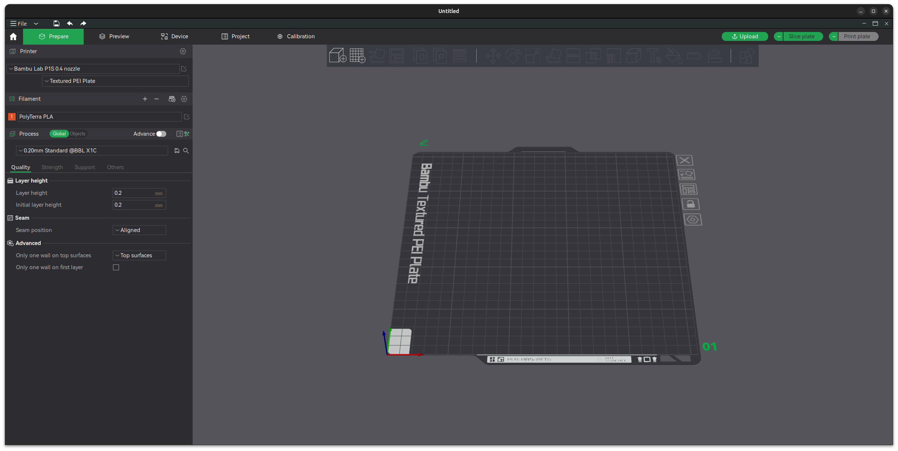

# Quickstart

## Programvare

* Bambu Studio (Desktop)
* Bambu Handy (Mobile)

## Installasjonsguide

1. Last ned og installer siste versjon av Bambu Studio
2. Konfigurer Bambu Studio slik:
   
   
   
   

3. Logg inn med et delt brukernavn og passord
    - Bambu Studio støtter dessverre ikke deling av printere på noen annen måte enn ved å benytte samme innloggingsdetaljer.
4. Gå til fanen **Prepare** og sørg for at de grunnleggende innstillingene er satt:
    - Printer er satt til **Bambu Lab P1S 0.4 nozzle**
    - Printer Plate er satt til **Textured PEI Plate**
      

## Innstillinger

Med mindre man har mye erfaring med 3D-printere er det ønskelig at man kun bruker de forhåndsdefinerte innstillingene for kvalitet og oppløsning av utskriften. Dette gjelder spesifikt ikke for en print som trenger support, typ en modell med mye overheng, da dette ikke er standard.

### Support

Support, eller støttemateriale, er strukturer som printes med hensikt om å støtte opp modellen der man ellers ville ha risikert å printe i "løse luften". De fleste 3D-printere har en praktisk grense ved 45 grader overheng.

## Før man printer

1. Bruk Bambu Studio til å slice modellen og noter hvor lang tid det vil ta å skrive ut modellen
2. Book plass på møterommet 3D-Printer i Outlook for tiden man planlegger å printe
3. Sørg for at det ikke finnes noe plast på byggeplaten. Av og til kan det være nødvendig å vaske byggeplaten, for eksempel hvis man har endt opp med å berøre midten av plata slik at det har blitt etterlat fingeravtrykk og fett fra fingre. Løft av den magnetiske plata og vask forsiktig med såpe og fingre, og tørk av i en retning med papir. Unngå å berøre midten av plata.
4. Verifiser at det er nok plast i fargen du ønsker å bruke
5. Start printen
6. Observer enten ved kamera eller fysisk at de første lagene av printen printes uten problemer, hovedårsaken til at en print feiler er typisk at de første lagene ikke blir bra.
7. Hent den ferdige modellen, og rydd opp etter deg. Sjekk at "poop chuten" er tom og fjern den lille kalibreringsstripa fra fronten av byggeplata.
