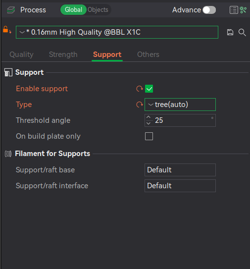

# Support

Support, eller støttemateriale, er strukturer som printes med hensikt om å støtte opp modellen der man ellers ville ha risikert å printe i "løse luften". De fleste 3D-printere har en praktisk grense ved 45 grader overheng.

Hvis det skal printes med support så anbefaler jeg å bruke innstillingene vist i dette bildet:

Det er ikke så farlig med hvilken kvalitetsinnstilling man velger (i dette tilfellet 0.16mm High Quality), men innstillingene under **Support**-fanen vil trolig dekke de fleste tilfeller.

## Ting å tenke på

* Trenger du virkelig support? 
    * Ofte kan man slippe unna å bruke support ved å rotere modellen, og eventuelt dele den opp i flere deler. Ikke bare vil dette gjerne spare tid, men man vil også ende opp med en penere overflate på printen.
* Hva slags support burde jeg bruke?
    * Det anbefales å bruke "tree"-support ettersom dette både er raskt å printe samt enklere å fjerne en "normal"-support.
